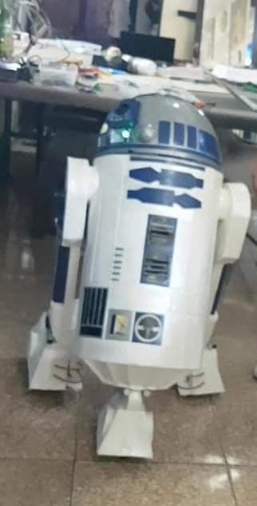

## R2D2 Robot Code

This code is designed to control a robot inspired by R2D2, using an Arduino board and various components such as servo motors, RGB LEDs, and DC motors.

**Components Used**

- Servo motor for head movement
- DC motors for leg movement
- RGB LED for the head
- Arduino Board

**Code Description**
The code consists of four functions: `setup()`, `loop()`, `motor1()`, `motor2()`, and `servo()`.

The `setup()` function initializes the pins of the Arduino board for the various components.

The `loop()` function calls `motor1()`, `servo()`, `motor2()`, and `servo()` in that order.

The `motor1()` function is designed to make R2D2 move forward for 3 seconds and then stop for 1 second. The `motor2()` function is designed to make R2D2 move backward for 3 seconds and then stop for 1 second. The `servo()` function controls the movement of the head of the robot.

Each of these functions uses `digitalWrite()` to control the output of the pins for the components, and `delay()` to control the timing of each movement.

**Pin Configuration**
The following pins are used in the code and are defined in the `setup()` function:

- myservo is attached to pin 8
- DC motor A: motorA1 is connected to pin 4 and motorA2 is connected to pin 5
- DC motor B: motorB1 is connected to pin 6 and motorB2 is connected to pin 7
- RGB LED: ledAzul is connected to pin 9, ledVerde is connected to pin 10, and ledVermelho is connected to pin 11

**How to Use**
To use this code, you will need to connect the various components to the Arduino board according to the pin configuration above. Then, you can upload the code to the board using the Arduino IDE and power the board using a power source. Once powered on, the robot will move forward and backward and its head will move in a sweeping motion.
